# Tonecast

> **Voice keyboard for iOS that rewrites what you said in the tone you pick — and translates it on the way.**

<p align="center">
  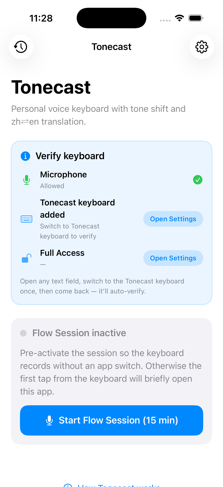
  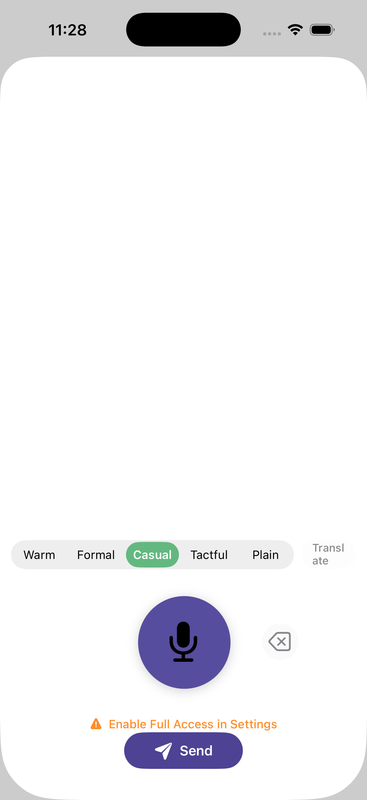
  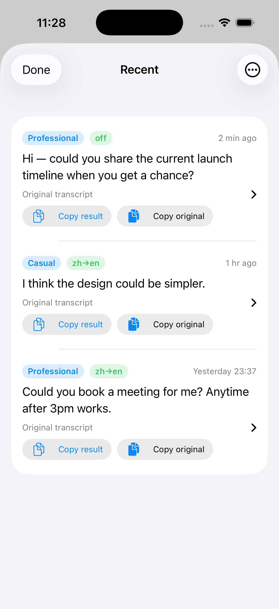
</p>

> ⚠️ **This is a public DEMO / reference repo.**
> The code is shared for people who want to see how a real iOS keyboard extension is wired up end-to-end: mic capture inside an extension, Whisper transcription, GPT tone rewriting, App Attest-gated proxy, StoreKit 2 subscription, and the UI around all of it. It is not a turnkey product — bundle IDs, signing, backend, and IAP need to be wired to your own accounts before it will run.

---

## What it does

Hold the mic in any text field, speak (中 / EN / mixed), release — Tonecast replaces what you said with the same idea, written in the **tone** you picked, optionally **translated** to the other language, then inserts it into the host app.

| Step | Layer | Tech |
| --- | --- | --- |
| 1. Capture | Keyboard extension, hold-to-talk mic | `AVAudioRecorder`, `RequestsOpenAccess`, "Allow Full Access" |
| 2. Transcribe | Whisper (multilingual, mixed-language tolerant) | OpenAI `gpt-4o-transcribe` via your proxy |
| 3. Rewrite | Tone-shift + optional zh⇄en translation, low-latency | OpenAI `gpt-4.1-mini` / `nano` via your proxy |
| 4. Insert | Result lands in the host text field via `UITextDocumentProxy` | UIKit keyboard extension |
| 5. Bill | Free tier = 200 req/day. Plus tier = 1,000 req/day | StoreKit 2 + server-side receipt verify |
| 6. Auth | Every request signed with App Attest assertion (no shared bearer) | `DCAppAttestService` + Cloudflare Worker |

Five built-in tones — **Warm / Formal / Casual / Tactful / Plain** — each with an editable English style guide and per-tone creativity (temperature). A "Plain" tone bypasses GPT entirely for verbatim dictation when you don't want a rewrite.

---

## Screens

<table>
<tr>
  <td align="center"><br/><sub><b>Home</b></sub></td>
  <td align="center">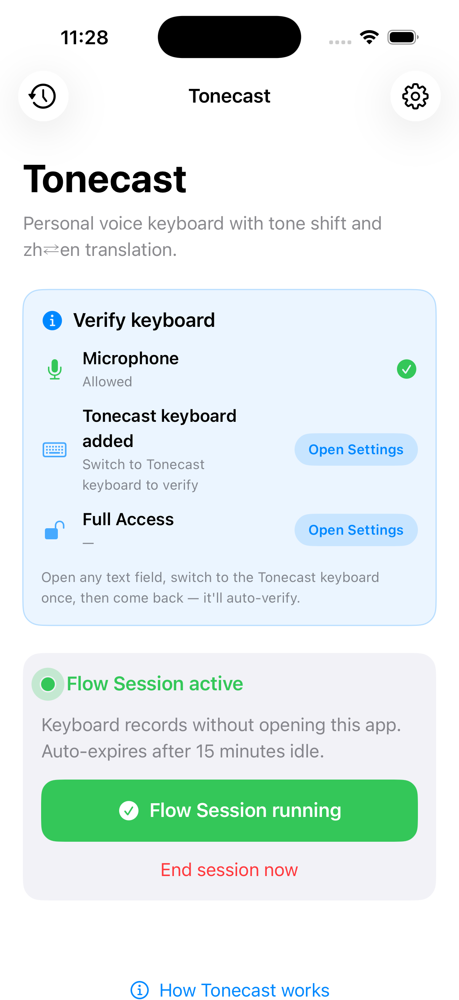<br/><sub><b>Flow Session active</b></sub></td>
  <td align="center">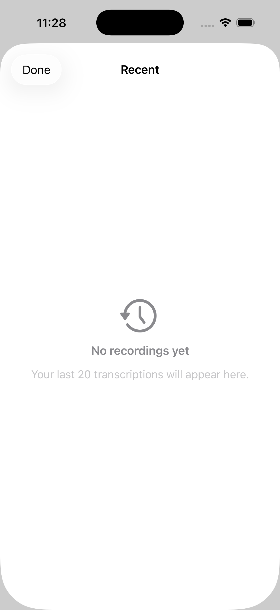<br/><sub><b>History — empty</b></sub></td>
  <td align="center"><br/><sub><b>History — seeded</b></sub></td>
</tr>
<tr>
  <td align="center"><br/><sub><b>Settings — tone defaults</b></sub></td>
  <td align="center">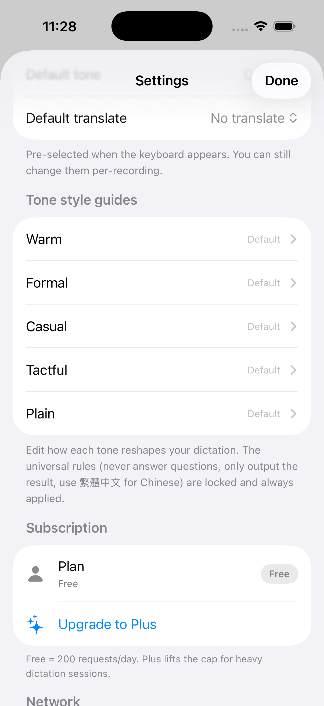<br/><sub><b>Settings — subscription</b></sub></td>
  <td align="center">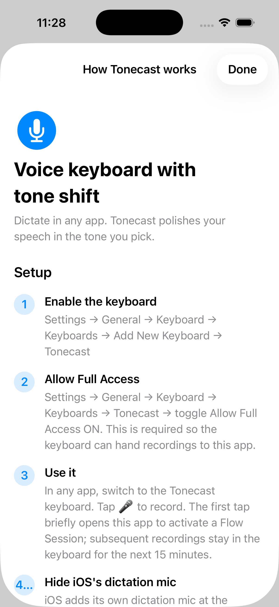<br/><sub><b>Setup guide ①</b></sub></td>
  <td align="center">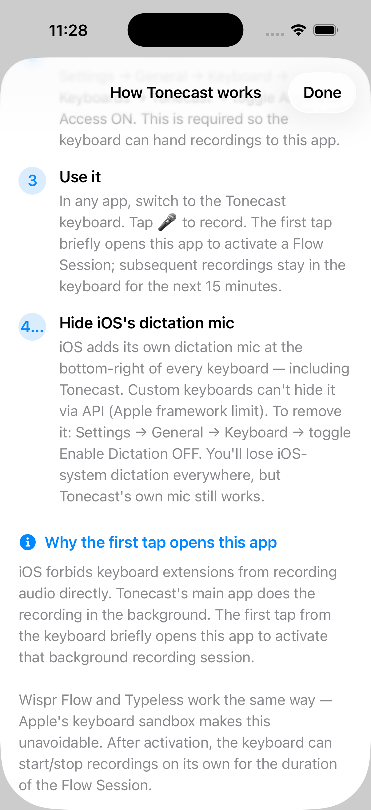<br/><sub><b>Setup guide ②</b></sub></td>
</tr>
<tr>
  <td align="center">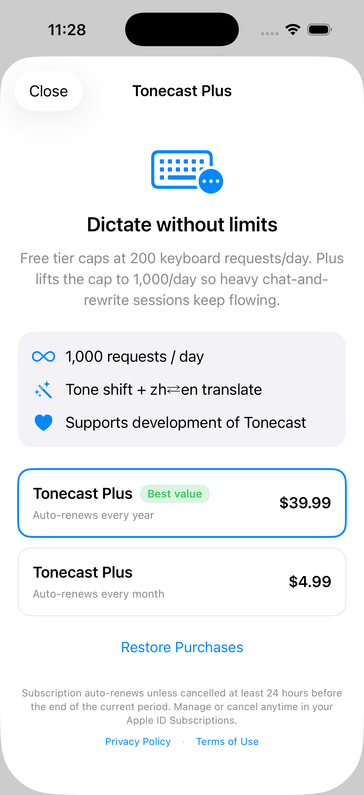<br/><sub><b>Paywall</b></sub></td>
  <td align="center">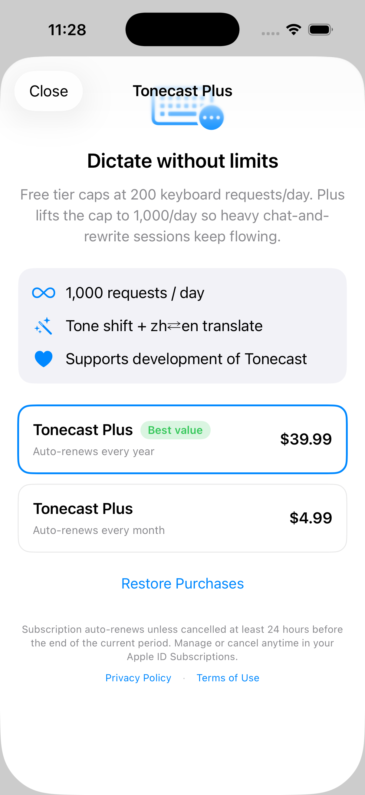<br/><sub><b>Paywall — legal</b></sub></td>
  <td align="center">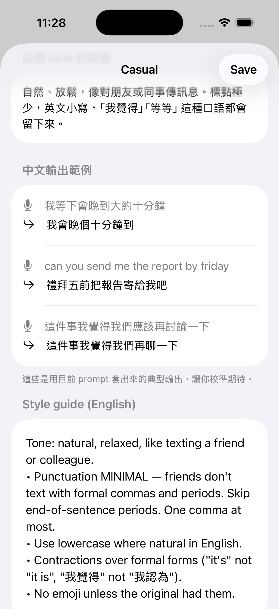<br/><sub><b>Tone editor — samples</b></sub></td>
  <td align="center"><br/><sub><b>Keyboard extension</b></sub></td>
</tr>
<tr>
  <td align="center">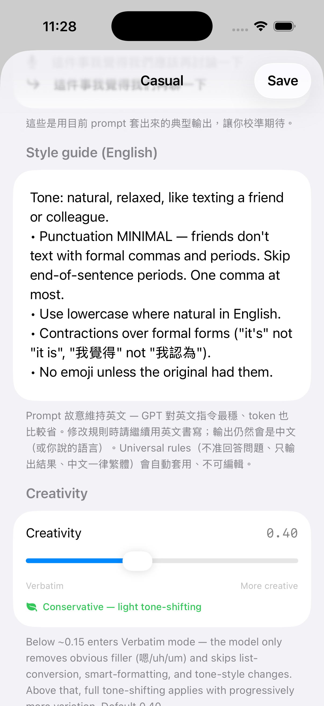<br/><sub><b>Tone editor — style guide</b></sub></td>
  <td align="center"><br/><sub><b>Tone editor — creativity</b></sub></td>
  <td></td>
  <td></td>
</tr>
</table>

Full caption + source-file mapping in [UI/README.md](UI/README.md).

---

## Repo layout

```
tonecast/
├── project.yml                  # xcodegen spec — single source of truth for Xcode project
├── Tonecast/                    # Main app (SwiftUI)
│   ├── TonecastApp.swift
│   ├── ContentView.swift        # Home: permission card + Flow Session
│   ├── HistoryView.swift        # Shared App Group history
│   ├── SettingsView.swift       # Recording prefs, vocab, defaults, network
│   ├── PaywallView.swift        # StoreKit 2 product cells + restore
│   ├── SetupGuideView.swift     # Onboarding flow
│   ├── TonePromptEditorView.swift   # Per-tone style guide + temperature
│   ├── ToneRewriter.swift       # GPT rewrite prompt assembly
│   ├── WhisperClient.swift      # Multipart audio upload
│   ├── AppAttestService.swift   # DeviceCheck + App Attest assertions
│   ├── IAPService.swift         # StoreKit 2 product lookup, purchase, receipt verify
│   ├── ProxyEndpoint.swift      # Resolves proxy base URL
│   └── Tonecast.entitlements    # App Group + App Attest
│
├── TonecastKeyboard/            # Keyboard extension (UIKit)
│   ├── KeyboardViewController.swift
│   ├── CircularMicButton.swift
│   ├── Info.plist               # RequestsOpenAccess = YES
│   └── TonecastKeyboard.entitlements
│
├── Shared/
│   └── SharedDefaults.swift     # App Group container constants
│
├── UI/                          # Simulator screenshots referenced in this README
├── docs/                        # IAP + TestFlight setup notes
├── scripts/                     # App Store Connect API helpers
└── tools/                       # render_icon.swift (AppIcon generator)
```

---

## How to run it locally

Before you start: you need an Apple Developer account, an OpenAI account (or compatible API), and a Cloudflare account if you want to spin up your own proxy. **No working backend is included in this repo** — Tonecast points at a placeholder `your-proxy.example.workers.dev` URL out of the box.

### 1. Generate the Xcode project

```bash
brew install xcodegen
xcodegen generate
open Tonecast.xcodeproj
```

The `.xcodeproj` is gitignored — regenerate any time `project.yml` changes.

### 2. Pick your own bundle IDs and Team ID

Edit [project.yml](project.yml):

```yaml
settings:
  base:
    DEVELOPMENT_TEAM: XXXXXXXXXX     # ← your 10-char Apple Developer Team ID
```

Then find/replace `com.example.tonecast` → your own reverse-DNS prefix across:

- `project.yml`
- `Tonecast/Tonecast.entitlements`
- `TonecastKeyboard/TonecastKeyboard.entitlements`
- `Shared/SharedDefaults.swift`

Re-run `xcodegen generate`.

### 3. Stand up a proxy (or point at your own)

Tonecast does **not** ship an OpenAI key in the binary. Every request goes to a small Cloudflare Worker that:

- Verifies an App Attest assertion against the registered key for the device
- Adds your OpenAI API key server-side
- Enforces a per-device rate limit (200 req/day Free, 1,000 req/day Plus)
- Forwards to OpenAI and streams the response back

Edit `Tonecast/ProxyEndpoint.swift`:

```swift
static let baseURL: URL = URL(string: "https://your-proxy.example.workers.dev")!
```

The Worker code itself is **not** in this repo (different service). The contract it has to satisfy is documented in [docs/IAP_SETUP_GUIDE.md](docs/IAP_SETUP_GUIDE.md) — receipt verification endpoint shape, App Attest header names, daily-cap response format. Bring your own.

### 4. Build to your iPhone

1. Plug in your iPhone, select it in Xcode's device picker
2. Select the **Tonecast** scheme (not the extension)
3. ⌘R to build and run — first install will prompt **Trust the developer** in `Settings → General → VPN & Device Management`
4. Open the **Tonecast** app once — it walks you through enabling the keyboard

### 5. Enable the keyboard

1. `Settings → General → Keyboard → Keyboards → Add New Keyboard → Tonecast`
2. Tap **Tonecast** in the list, toggle **Allow Full Access** ON
   - This grants the extension mic + network access. Without it the keyboard renders a "Enable Full Access in Settings" hint and refuses to record.

### 6. Use it

In any text field, long-press the 🌐 globe → switch to Tonecast. Pick a tone chip, optionally toggle Translate, press and hold 🎤, speak, release. Result lands in the text field.

---

## Subscription wiring (optional)

[docs/IAP_SETUP_GUIDE.md](docs/IAP_SETUP_GUIDE.md) walks through creating the **Tonecast Plus** subscription group + `tonecast.plus.monthly` / `tonecast.plus.annual` products in App Store Connect. `scripts/asc/asc_setup.py` automates the API side once you have an ASC API key in environment variables (`APP_STORE_KEY_ID` / `APP_STORE_KEY_ISSUER_ID` / `APP_STORE_KEY_PATH`).

You can ignore all of this and use the Free tier — set the proxy daily cap to whatever you want.

---

## TestFlight (optional)

[docs/TESTFLIGHT_SETUP.md](docs/TESTFLIGHT_SETUP.md) covers the one-time identifiers + agreements; `ship.sh` is the every-release archive + upload script. Requires ASC API credentials in env vars (same three from above).

---

## What's intentionally **not** here

- **The OpenAI API key.** It lives only on the proxy. Even if you reverse-engineered the IPA you'd find nothing.
- **The Cloudflare Worker source.** Different repo. Sketch of what it does is in the IAP guide.
- **Real Team ID, ASC Key ID, Bundle ID prefix.** All placeholders (`XXXXXXXXXX`, `com.example.*`, etc.). Wire your own.
- **Legal pages.** Privacy / Terms link out to your own GitHub Pages — see the `your-org.github.io/legal-pages/` references in `PaywallView.swift`.

---

## Stack

- **iOS 17+** (Swift 5.9, SwiftUI for the app, UIKit for the keyboard extension)
- **xcodegen** for project generation
- **StoreKit 2** for in-app purchases
- **App Attest** (`DCAppAttestService`) for unforgeable client identity
- **OpenAI Whisper + GPT** through a Cloudflare Worker proxy (not included)

---

## License

MIT. See [LICENSE](LICENSE).

---

## Notes

This is shared as a reference / portfolio piece. PRs aren't actively merged, but issues / questions about how a specific piece is wired are welcome.
